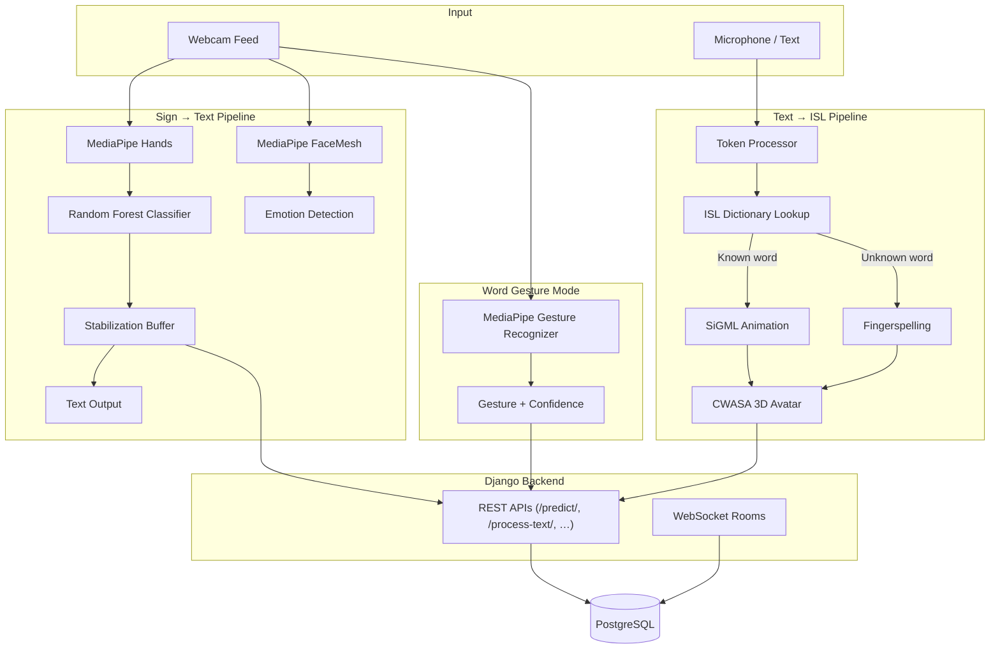

# Silent Talk

**Bridging silence with AI — a real-time Indian Sign Language (ISL) communication platform.**

Silent Talk is a full-stack accessibility project that helps hearing and deaf/mute individuals communicate more naturally. It combines computer vision, machine learning, and a modern web interface to translate **sign language ↔ text/speech**, teach ISL interactively, and animate signs through a **3D avatar**.

Built for the **63+ million** people in India with speech or hearing impairments, Silent Talk integrates multiple recognition pipelines into one Django-powered platform.

---

## Table of Contents

- [Features](#features)
- [Architecture](#architecture)
- [Technology Stack](#technology-stack)
- [Project Structure](#project-structure)
- [Prerequisites](#prerequisites)
- [Installation](#installation)
- [Running the Application](#running-the-application)
- [Usage Guide](#usage-guide)
- [API Reference](#api-reference)
- [Machine Learning Models](#machine-learning-models)
- [Standalone Modules](#standalone-modules)
- [Testing](#testing)
- [Troubleshooting](#troubleshooting)
- [Future Enhancements](#future-enhancements)
- [Documentation](#documentation)
- [Acknowledgments](#acknowledgments)

---

## Features

### Sign → Text Recognition
- Real-time **ISL letter recognition** (A–Z, 0–9, space, full stop) via webcam
- **MediaPipe Hands** extracts 21 landmarks per frame → **Random Forest** classifier
- Prediction stabilization buffer for accurate word and sentence formation
- **Text-to-Speech** reads recognized sentences aloud in the browser
- **Facial emotion detection** (happy, sad, urgent, surprised, neutral) using MediaPipe FaceMesh

### Text → ISL Avatar
- Type text or use **Web Speech API** for voice input
- Tokenizes input against an **850+ word ISL dictionary**
- Unknown words are **fingerspelled** letter by letter
- **CWASA/JAS 3D avatar** (Marc) plays **848 SiGML** animation files sequentially

### Word Gesture Mode
- Recognizes **7 common hand gestures** instantly using MediaPipe Gesture Recognizer:
  - 👍 Thumbs Up · 👎 Thumbs Down · ✌️ Victory · 🤟 I Love You
  - ✊ Closed Fist · 🖐️ Open Palm · ☝️ Pointing Up
- Live confidence scoring and visual feedback

### Learn ISL
- Interactive alphabet learning with guided and practice modes
- Progress tracking (mastered / guided letters) for authenticated users
- Gamified feedback — celebration animations, progress rings, and live camera practice

### User Accounts & Real-Time Chat *(planned)*
- Registration, login, and profile management
- WebSocket-based conversation rooms via **Django Channels**

### Modern UI
- Responsive design with **Tailwind CSS**, dark/light theme toggle
- Smooth animations via **AOS** (Animate On Scroll)
- Material Symbols iconography and Manrope/Inter typography

---

## Architecture



---

## Technology Stack

| Layer | Technologies |
|-------|-------------|
| **Web Framework** | Django 5.2, Django REST Framework |
| **Real-Time** | Django Channels, Daphne, WebSockets |
| **Computer Vision** | MediaPipe (Hands, FaceMesh, Gesture Recognizer), OpenCV |
| **Machine Learning** | scikit-learn (Random Forest), TensorFlow/Keras (LSTM — standalone module) |
| **NLP** *(standalone)* | Stanford Parser, NLTK |
| **Avatar Engine** | JAS/CWASA (Java Animated Signing), SiGML |
| **Frontend** | HTML5, Tailwind CSS, JavaScript, jQuery, AOS |
| **Speech** | Web Speech API (browser), pyttsx3 *(standalone)* |
| **Database** | PostgreSQL |
| **Desktop GUI** *(standalone)* | Tkinter, OpenCV |

---

## Project Structure

```
SilentTalk - The Project - Copy/
├── README.md                          ← You are here
└── silenttalk/
    ├── manage.py                      ← Django entry point
    ├── requirements.txt               ← Core Python dependencies
    ├── PROJECT_DOCUMENTATION.md       ← Detailed technical documentation
    ├── SILENT_TALK_TEST_REPORT.md     ← QA test report
    │
    ├── silenttalk/                    ← Django project settings
    │   ├── settings.py
    │   ├── urls.py
    │   ├── asgi.py                    ← Channels / WebSocket routing
    │   └── wsgi.py
    │
    ├── recognition/                   ← Core recognition app
    │   ├── views.py                   ← Page views & API endpoints
    │   ├── ai_engine.py               ← Letter recognition + emotion detection
    │   ├── gesture_engine.py          ← MediaPipe gesture recognizer
    │   ├── model.p                    ← Trained Random Forest model (3.3 MB)
    │   ├── static/recognition/
    │   │   ├── SignFiles/             ← 848 SiGML animation files
    │   │   ├── js/allcsa.js           ← CWASA avatar engine
    │   │   ├── js/sigmlFiles.json     ← Sign file mappings
    │   │   └── words.txt              ← ISL vocabulary (803+ words)
    │   └── templates/recognition/     ← HTML templates
    │
    ├── users/                         ← Authentication & profiles
    ├── learn/                         ← ISL learning progress tracking
    ├── conversation/                  ← Real-time chat rooms (WebSockets)
    │
    ├── ActionDetectionforSignLanguage/   ← Standalone LSTM gesture detection
    ├── AudioToSignLanguageConverter/       ← Standalone Flask speech→ISL app
    ├── Sign-Language-to-Text-and-Speech/   ← Standalone Tkinter letter recognition
    └── stitch_sign_recognition/            ← UI/UX design iterations
```

---

## Prerequisites

| Requirement | Version / Notes |
|-------------|-----------------|
| **Python** | 3.10+ (tested on 3.10.11) |
| **PostgreSQL** | 12+ running on `localhost:5432` |
| **Web Browser** | Google Chrome recommended (Web Speech API + camera access) |
| **Webcam** | Required for sign recognition and learning modes |
| **Microphone** | Optional — for speech-to-ISL input |
| **Git** | For cloning the repository |

---

## Installation

### 1. Clone the repository

```bash
git clone <repository-url>
cd "SilentTalk - The Project - Copy/silenttalk"
```

### 2. Create and activate a virtual environment

**Windows (PowerShell):**
```powershell
python -m venv silenttalk_env
.\silenttalk_env\Scripts\Activate.ps1
```

**macOS / Linux:**
```bash
python3 -m venv silenttalk_env
source silenttalk_env/bin/activate
```

### 3. Install Python dependencies

```bash
pip install -r requirements.txt
pip install opencv-python channels daphne psycopg2-binary
```

> **Note:** `opencv-python`, `channels`, `daphne`, and `psycopg2-binary` are required by the application but may not all be listed in `requirements.txt`. Install them explicitly if needed.

**Recommended versions** (from QA testing):

| Package | Version |
|---------|---------|
| Django | 5.2.x |
| MediaPipe | 0.10.9 |
| scikit-learn | 1.5.2 *(model trained on this version)* |
| NumPy | 1.26.x |
| OpenCV | 4.8.x |
| TensorFlow | 2.15.x *(standalone modules only)* |

### 4. Set up PostgreSQL

Create the database and user referenced in `silenttalk/settings.py`:

```sql
CREATE DATABASE silenttalkdb;
CREATE USER postgres WITH PASSWORD 'admin123';
GRANT ALL PRIVILEGES ON DATABASE silenttalkdb TO postgres;
```

Update credentials in `silenttalk/silenttalk/settings.py` if your local setup differs:

```python
DATABASES = {
    'default': {
        'ENGINE': 'django.db.backends.postgresql',
        'NAME': 'silenttalkdb',
        'USER': 'postgres',
        'PASSWORD': 'admin123',
        'HOST': 'localhost',
        'PORT': '5432',
    }
}
```

### 5. Run database migrations

```bash
python manage.py migrate
```

### 6. Create a superuser *(optional)*

```bash
python manage.py createsuperuser
```

### 7. Verify model files exist

Ensure these files are present before starting the server:

| File | Location | Purpose |
|------|----------|---------|
| `model.p` | `recognition/model.p` | Random Forest letter classifier |
| `gesture_recognizer.task` | `recognition/static/recognition/` | MediaPipe gesture model |

---

## Running the Application

Start the Django development server:

```bash
python manage.py runserver
```

Open your browser and navigate to:

```
http://127.0.0.1:8000/
```

For WebSocket support (conversation rooms), use an ASGI server:

```bash
daphne -b 127.0.0.1 -p 8000 silenttalk.asgi:application
```

---

## Usage Guide

### Sign → Text (`/recognize/`)

1. Allow camera access when prompted.
2. Perform ISL hand signs for letters A–Z, digits 0–9, space, or full stop.
3. Hold each sign steady until it appears in the word buffer.
4. Use the space gesture to finish a word; use full stop to end a sentence.
5. Click **Speak** to hear the sentence via the browser's speech synthesis.
6. Emotion indicators update in real time from facial expression analysis.

### Text → ISL (`/text-to-isl/`)

1. Wait for the 3D avatar engine to finish loading.
2. Type text in the input field **or** click the microphone button and speak.
3. Press **Translate** — the avatar performs each sign sequentially.
4. Known dictionary words play as full signs; unknown words are fingerspelled.

### Word Gestures (`/gesture/`)

1. Enable your webcam.
2. Perform one of the 7 supported gestures.
3. View the detected gesture name, emoji, and confidence score in real time.

### Learn ISL (`/learn/`)

1. Browse the A–Z alphabet cards.
2. Switch between **Guided** and **Practice** modes.
3. Use your webcam to mimic each sign.
4. Track progress with the mastery ring; log in to persist progress across sessions.

### Admin Panel (`/admin/`)

Manage users, learning records, and application data through Django's built-in admin interface.

---

## API Reference

All API endpoints accept **POST** requests with `@csrf_exempt` enabled for development.

### `POST /predict/`

Recognize a hand sign letter and detect facial emotion from a camera frame.

**Request body (form data):**
```
frame: data:image/jpeg;base64,<base64-encoded-image>
```

**Response:**
```json
{
  "letter": "A",
  "emotion": "happy",
  "face_detected": true
}
```

---

### `POST /predict-gesture/`

Recognize a word-level hand gesture.

**Request body (form data):**
```
frame: data:image/jpeg;base64,<base64-encoded-image>
```

**Response:**
```json
{
  "gesture": "Thumb_Up",
  "display": "Thumbs Up 👍",
  "confidence": 0.952
}
```

---

### `POST /process-text/`

Convert English text into ISL-compatible tokens for avatar playback.

**Request body (form data):**
```
text: Hello how are you
```

**Response:**
```json
{
  "tokens": ["hello", "how", "are", "you"],
  "original": "Hello how are you"
}
```

Unknown words are split into individual alphanumeric characters for fingerspelling.

---

## Machine Learning Models

### Model 1 — Random Forest Letter Classifier (`model.p`)

| Property | Value |
|----------|-------|
| **Algorithm** | Random Forest (100 estimators) |
| **Input** | 42 features — 21 hand landmarks × (x, y), normalized |
| **Classes** | 38 — A–Z, 0–9, space, full stop |
| **Detection** | MediaPipe Hands (single hand, confidence ≥ 0.5) |
| **Latency** | ~17 ms mean prediction time |
| **Training data** | ~100 images per class |

### Model 2 — MediaPipe Gesture Recognizer (`gesture_recognizer.task`)

| Property | Value |
|----------|-------|
| **Format** | MediaPipe Tasks (`.task`) |
| **Gestures** | 7 pre-trained word-level gestures |
| **Latency** | ~19 ms mean prediction time |
| **Hands** | Up to 2 hands detected |

### Model 3 — FaceMesh Emotion Detection *(rule-based)*

| Property | Value |
|----------|-------|
| **Engine** | MediaPipe FaceMesh landmark geometry |
| **Emotions** | happy, sad, urgent, surprised, neutral |
| **Method** | Threshold-based analysis of mouth, eyebrow, and eye landmarks |

### Model 4 — LSTM Action Recognition (`action.h5`) *(standalone module)*

| Property | Value |
|----------|-------|
| **Architecture** | 3-layer LSTM (64 → 128 → 64 units) |
| **Input** | 30 frames × 1662 holistic keypoint features |
| **Actions** | hello, thanks, iloveyou |
| **Accuracy** | ~95%+ |

---

## Standalone Modules

Silent Talk bundles several independent tools that can be run outside the Django web app.

### ActionDetectionforSignLanguage

Real-time word-level sign detection using MediaPipe Holistic + LSTM.

```bash
cd ActionDetectionforSignLanguage
python run.py
```

Requires `action.h5` and a webcam.

---

### Sign-Language-to-Text-and-Speech

Desktop Tkinter app for ASL letter recognition with text-to-speech output.

```bash
cd Sign-Language-to-Text-and-Speech
pip install opencv-python mediapipe scikit-learn pyttsx3 pillow
python main.py
```

---

### AudioToSignLanguageConverter

Flask server that converts spoken English to ISL avatar animations using Stanford Parser NLP.

```bash
cd AudioToSignLanguageConverter
pip install flask flask-cors nltk
python server.py
# Open index.html in Chrome via localhost
```

Requires the [Stanford Parser](https://nlp.stanford.edu/software/stanford-parser-full-2018-10-17.zip) extracted into the module directory.

---

## Testing

A comprehensive QA test suite has been run against the platform. See [`silenttalk/SILENT_TALK_TEST_REPORT.md`](silenttalk/SILENT_TALK_TEST_REPORT.md) for full results.

**Summary (54 tests):**

| Category | Pass Rate |
|----------|-----------|
| Environment & Dependencies | 100% |
| Django Server & URLs | 81.8% |
| AI Engine Unit Tests | 100% |
| Gesture Engine Unit Tests | 100% |
| API Integration | 90% |
| Code Quality | 100% |
| **Overall** | **94.4%** |

Run Django's built-in checks:

```bash
python manage.py check
```

---

## Troubleshooting

### `FileNotFoundError: model.p`
Ensure `recognition/model.p` exists. This file is required at startup by `ai_engine.py`.

### `FileNotFoundError: gesture_recognizer.task`
Download or restore the MediaPipe gesture model to `recognition/static/recognition/gesture_recognizer.task`.

### scikit-learn version mismatch
The Random Forest model was trained with **scikit-learn 1.5.2**. If predictions behave inconsistently, pin the version:

```bash
pip install scikit-learn==1.5.2
```

### PostgreSQL connection refused
Verify PostgreSQL is running and that `DATABASES` settings in `settings.py` match your local credentials.

### Camera not working
- Use **HTTPS or localhost** — browsers block camera access on insecure origins.
- Grant camera permissions in browser settings.
- Close other applications that may be using the webcam.

### Avatar not loading on Text → ISL page
- Wait for the loading overlay to disappear (CWASA engine initialization).
- Check the browser console for failed static file requests.
- Ensure `SignFiles/` and `sigmlFiles.json` are present under `recognition/static/recognition/`.

### Speech recognition not working
The Web Speech API is supported primarily in **Google Chrome**. Use Chrome for speech-to-text features.

### Server warmup / first request fails
The AI engine loads models on first import (~2 s for `model.p`). Allow a moment after server start before sending requests.

---

## Future Enhancements

- Expanded ISL vocabulary and dynamic gesture training
- Mobile app (React Native / Flutter)
- Live video call integration with real-time translation
- CNN/RNN models for improved recognition accuracy
- Support for regional Indian sign languages
- Community-contributed sign dictionary

---

## Documentation

| Document | Description |
|----------|-------------|
| [`silenttalk/PROJECT_DOCUMENTATION.md`](silenttalk/PROJECT_DOCUMENTATION.md) | Full technical architecture and component analysis |
| [`silenttalk/SILENT_TALK_TEST_REPORT.md`](silenttalk/SILENT_TALK_TEST_REPORT.md) | Automated QA test results and performance benchmarks |
| [`silenttalk/Sign-Language-to-Text-and-Speech/README.md`](silenttalk/Sign-Language-to-Text-and-Speech/README.md) | Standalone letter recognition module docs |
| [`silenttalk/AudioToSignLanguageConverter/README.md`](silenttalk/AudioToSignLanguageConverter/README.md) | Standalone audio-to-ISL module docs |

---

## Acknowledgments

Silent Talk builds on and integrates work from several open-source and research projects:

- **MediaPipe** — Google’s framework for hand, face, and pose tracking
- **CWASA/JAS** — Java Animated Signing avatar engine
- **Sign-Language-to-Text-and-Speech** — Random Forest ASL recognition pipeline
- **AudioToSignLanguageConverter** — Stanford Parser–based English-to-ISL translation
- **ActionDetectionforSignLanguage** — LSTM holistic gesture detection

Developed as a **Full Stack Development** semester project to improve communication accessibility for the deaf and hard-of-hearing community in India.

---

<p align="center">
  <strong>Silent Talk</strong> — Breaking barriers, one sign at a time. 🤟
</p>
